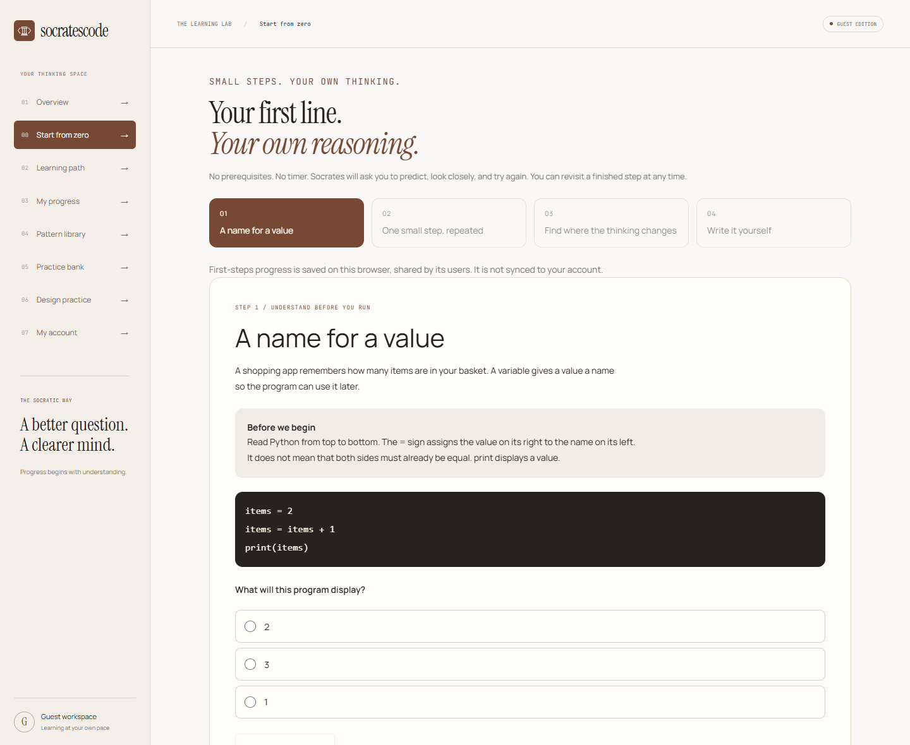
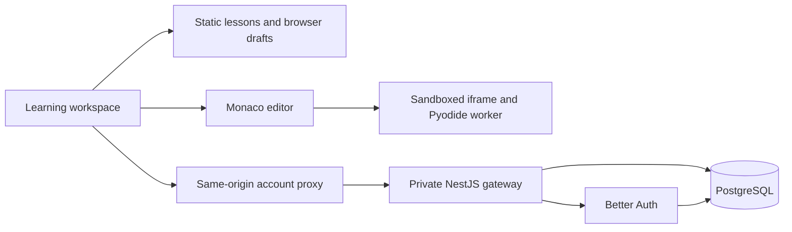

<div align="center">

# socratescode
### Learn the logic. Write the code. Explain the why.

A Socratic learning lab for your first line of Python
and the engineering decisions that come after it.

[Open the app](https://wepapp-socratescode.vercel.app/) · [Explore the landing page](https://socratescode.vercel.app/) · [Documentation](docs/Home.md)

[](https://github.com/Alishba-Siddique/wepapp-socratescode/actions/workflows/frontend.yml)



**Next.js · TypeScript · Monaco · Pyodide · Better Auth · PostgreSQL**

</div>

## From "AI wrote it" to "I understand it"

You can start here without a coding background. Work through tiny examples, predict what changes, investigate mistakes, and write your own solution. Socrates asks guiding questions; the platform does not generate the answer for you.

The learning loop is **Predict → Run → Investigate → Modify → Make**. Completing exercises is practice evidence, not a promise of interview readiness or seniority.

## Your thinking space

| Experience | What you can do |
| --- | --- |
| **Start from zero** | Learn variables, loops and debugging, then write a function in the Python editor |
| **9 logic labs** | Predict results, inspect state, change assumptions and explain your reasoning |
| **23 coding problems** | Use Monaco or the simple editor, run Python, inspect public checks and try custom inputs |
| **Debug with Socrates** | Predict three broken programs, isolate the cause, repair real Python and explain your fix |
| **Learn the debugging method** | Identify error types, reproduce failures, compare traced state and plan regression tests |
| **Debugging notebooks** | Record evidence and hypotheses, save locally, and export Markdown to Obsidian |
| **Personal regression tests** | Save up to six cases per coding problem, predict outputs and investigate mismatches |
| **Chrome companion preview** | Think through LeetCode problems with authored questions, local notes and Markdown export |
| **17 pattern lessons** | Connect algorithms to real products, trace decisions and challenge assumptions |
| **6 design exercises** | Practise system design, database constraints and architecture tradeoffs |
| **54 external references** | Find further practice by topic and source |
| **Your notes** | Resume browser drafts and export design reasoning to Markdown |

Feedback is authored and deterministic. No live AI tutor or automatic prose grading is connected. Eight coding exercises are adapted from MIT-licensed Exercism specifications with pinned provenance.

[Install the Chrome companion preview](https://wepapp-socratescode.vercel.app/companion) or read its [source and permission guide](extension/README.md). The extension uses explicit title/URL capture, not problem scraping or automatic submissions. No API key is required.

## Try it locally

Use the Node version in `.node-version`.

```sh
cd frontend
npm ci
npm run dev -- --port 3001
```

Open **http://localhost:3001/start**. Guest learning works without a database or API key. Python runs on the learner's device; its first run downloads the self-hosted runtime.

For the optional account service, follow [Local Development](docs/Local%20Development.md). It uses Better Auth, NestJS, Prisma and PostgreSQL, with explicit guest-progress import and version-checked saves.

## How it fits together



Learning content and local Python execution do not depend on account hosting. The gateway owns database access; credentials never belong in browser configuration. See [Architecture](docs/Architecture.md) and [API and Data](docs/API%20and%20Data.md).

## Quality is part of the feature

- Strict TypeScript, domain checks, lint and a production build.
- Chromium, Firefox and WebKit journeys covering incorrect answers, persistence, keyboard navigation and mobile layouts.
- Account tests with real PostgreSQL: ownership, conflicting writes, import replay, sessions and admission limits.
- Dependency review, CodeQL and production dependency audits.
- Candidate deployment tests before promotion; release identity checks and a rollback workflow.

```sh
cd frontend
npm test
npm run lint
npm run typecheck
npm run build
```

See [Testing](docs/Testing.md) for browser and account commands, and [Delivery](docs/Delivery.md) for deployment and recovery.

## Clear boundaries

| Area | Current boundary |
| --- | --- |
| Accounts | Implemented; production gateway, database and email configuration remain pending |
| Progress | First steps, coding and design drafts are browser-local; configured accounts save PRIMM lab progress |
| Execution | Browser worker with deadlines and network restrictions; no hard browser-memory quota or trusted hidden judge |
| Tutoring | Authored questions and self-review; live inference is not enabled |
| Hosting | Guest app on Vercel; Cloudflare migration remains planned |
| Scale | Static content and client execution now; introduce additional services only for demonstrated requirements |

These are engineering boundaries, not a security certification. Read the [Security Audit](docs/Security%20Audit.md) before changing an entry point.

## Documentation that stays with the code

Open **`docs/` as an Obsidian vault**. The notes are plain Markdown and require no paid plugin.

[Start here](docs/Home.md) · [Product guide](docs/Platform%20Guide.md) · [Learning design](docs/Learning%20Design.md) · [Roadmap](docs/Build%20Plan.md) · [Engineering standards](docs/Engineering%20Standards.md) · [Content and licensing](docs/Content%20and%20Licensing.md)

Feature work follows: define acceptance · implement · test failures · update the docs · review · verify the release. Do not commit secrets or represent planned services as deployed.

---

**Built by [Alishba Siddique](https://github.com/Alishba-Siddique).**
One question at a time. More understanding with every step.
