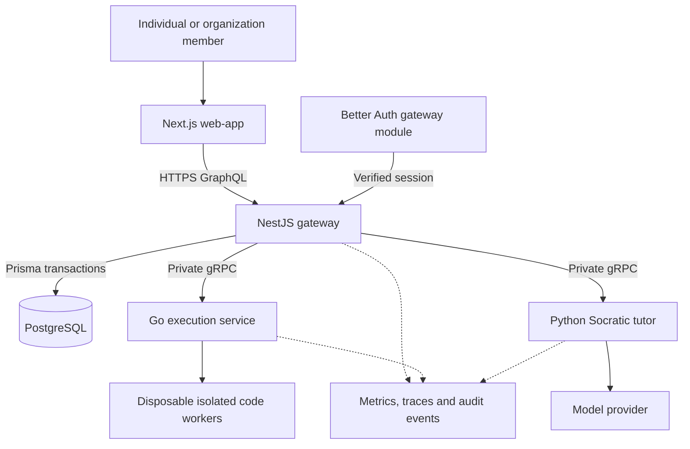

# System Design
[[Home]] | [[Architecture]] | [[Build Plan]] | [[GitHub Setup]]

## Direction
Build a reliable learning product that can support individuals and organizations. Start with one modular application gateway; isolate code execution and tutoring because they have different trust, cost, and scaling requirements. Enterprise readiness is an acceptance standard, not a claim that the current prototype meets it.

## Request path

Target architecture; only the frontend and local guided exercises are connected today.

Browser (Next.js) -> HTTPS GraphQL -> NestJS application gateway.

The gateway validates identity and organization membership, enforces policy, executes application use cases, and owns Prisma/PostgreSQL transactions. It calls the Go execution service and Python tutor service through private gRPC contracts. The browser, execution workers, and tutor never connect directly to the database.

| Component | Responsibility | Current status |
| --- | --- | --- |
| Next.js frontend | Dashboard, curriculum, PRIMM activities, accessible navigation | Implemented guest increment |
| Local progress adapter | Validated browser persistence, no account synchronization | Implemented |
| NestJS gateway | Identity, authorization, attempts, progress, organizations, audit events | Planned |
| PostgreSQL / Prisma | Durable relational data and transactional updates | Planned |
| PostgreSQL outbox / RabbitMQ | Commit domain events atomically, publish with confirms, consume with deduplication | Planned |
| Valkey | Shared admission limits, concurrency and budget reservations | Planned |
| Go execution service | Schedule isolated runs, enforce resource limits, return traces | Planned |
| Python tutor | Ask constrained pedagogical questions from trace context | Scaffold; not connected |
| Better Auth gateway module | Database sessions through PostgreSQL/Prisma; HTTP auth endpoints; SSO later when required | Planned; replaces Clerk |
| Observability | Correlated traces, metrics, structured logs and alerts | Planned |

## Application modules and data
Keep identity, organizations, curriculum, attempts, progress, tutoring, and audit modules separate behind application interfaces. Pure domain logic must not depend on NestJS, Prisma, or a transport library.

Core records: User, Organization, Membership, Lab, LabVersion, Attempt, TraceRun, Reflection, HintEvent, Progress and AuditEvent. Use immutable lab versions so a saved attempt retains the exercise it actually used. Membership roles begin as owner, administrator, instructor and learner. Define their permission matrix before exposing organization endpoints.

Every organization-owned query and mutation is scoped using verified membership. Never trust a browser-supplied organization ID alone. Enforce ownership in the gateway, test cross-tenant access attempts, and consider row-level security as defense in depth when designing migrations. Personal workspaces remain distinct from organization-owned data.

## Execution boundary
Submit a run with an idempotency key, lab version, language and validated input. The planned gateway commits a pending run and outbox event in one PostgreSQL transaction. A publisher forwards the event to RabbitMQ with confirms; workers deduplicate deliveries and submit bounded results through a private service contract. Acknowledge only after the result is durably accepted. Polling/subscriptions report explicit run states; do not hold an HTTP request open indefinitely. This is at-least-once delivery, with application idempotency, not an exactly-once guarantee.

Untrusted code runs in disposable isolation with CPU, memory, time, process-count and output limits, no outbound network, no secrets, a read-only base filesystem and an ephemeral work directory. A Go service by itself is not a sandbox. Select and validate the actual isolation mechanism before accepting arbitrary code. Cancellation, worker crashes and timeouts must leave a retriable, explicit run state.

## Tutor boundary
Send minimal authorized exercise and trace context. Treat learner code and text as untrusted data. Responses must guide reasoning with a question, without a complete solution or code block. Validate outputs and enforce per-user and organization budgets. Provider failures fall back to clearly labeled authored hints. Test prompt injection, answer leakage, ambiguous questions and unsafe output before launch.

## Enterprise release gates
- Authorization and tenant-isolation tests; documented roles and membership lifecycle.
- Server-authoritative completion and assessment; browser progress is never trusted as certification.
- Encryption in transit, managed secrets, scoped service identities, session expiry and rate limits.
- Durable progress, idempotent retries, migration rollback strategy, automated backups and a proven restore.
- Structured audit events for access and administrative changes; no raw learner code or private reflections in ordinary logs.
- Defined retention, export and deletion behavior for personal and organization data.
- Staging and production separation, protected releases, health checks, rollback and incident ownership.
- Measured accessibility, load and end-to-end tests; agree availability, latency and recovery targets before a business pilot.

SSO, SCIM, regional hosting and compliance commitments require customer requirements and verification. They are not implemented or claimed today. Kubernetes is a later operational choice; the current k8s folder does not establish production readiness.

## Build order
1. Verify the complete guest learning loop and responsive interface.
2. Define GraphQL contracts and durable progress models; add identity, gateway and migrations.
3. Define protobuf contracts; implement and test isolated execution.
4. Integrate tutoring with evaluations, budgets and failure behavior.
5. Add organizations, scoped roles, reporting and the enterprise release gates above.

## Implemented September 20 boundary
[[Architecture]] is the current implementation map. Next.js proxies an allowlisted same-origin account API to NestJS/Better Auth/Prisma/PostgreSQL. The browser Python runner is independent and has no application-service access. PostgreSQL admission counters are the implemented shared limiter; RabbitMQ, Go, Valkey, live AI and organization services remain planned. Cloudflare migration is not configured or verified by this change.
